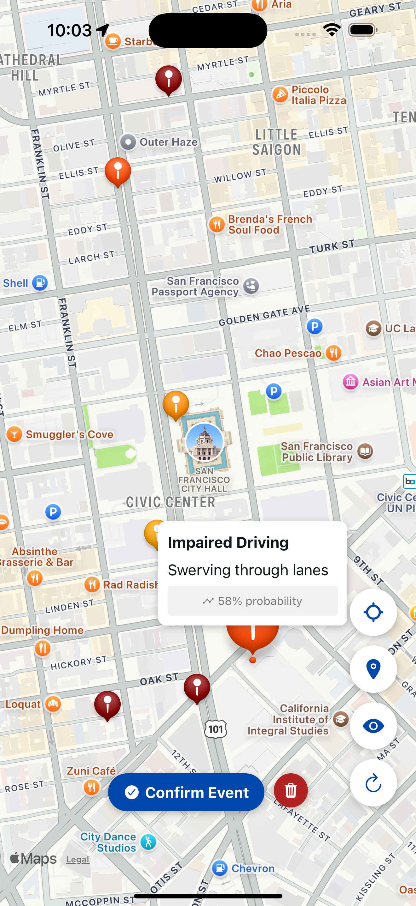

# Heq.tech Mobile App 🚘📱
AI-powered road safety in your pocket.

This is the official React Native mobile app for Heq.tech, a platform that uses real-time traffic camera analysis to detect impaired driving and alert users about dangerous areas nearby.
Stay informed, stay safe.

## 🚀 Features
	•	Real-time alerts of impaired drivers in your vicinity
	•	Clean, intuitive UI built with React Native
	•	Secure backend integration with impairment detection model
	•	Live CCTV integration (multi-camera support)

## 🛠️ Tech Stack
	•	React Native
	•	Redux / Context API
	•	Node.js + Flask backend (API integration)
	•	MongoDB (data storage)
	•	YOLO + OpenCV (object detection)
	•	GRU model (driver behavior classification)

## 📱 Screenshots

  

